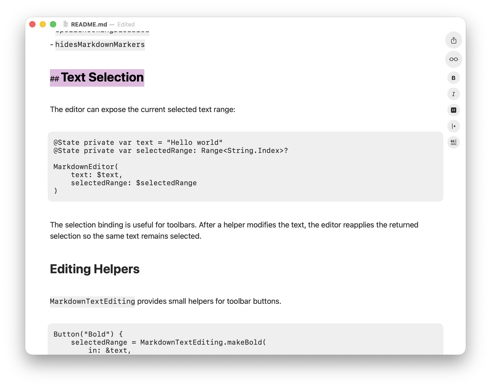

# MarkdownEngineLite

MarkdownEngineLite is a deliberately small SwiftUI Markdown editor inspired by the main idea behind `nodes-app/swift-markdown-engine`: Markdown is styled directly inside the text editor while you type.

It is not a port of the full original engine. Instead, it focuses on a lightweight iOS/macOS package with native text views, immediate formatting, hidden Markdown markers, PDF export, and a few editing helpers.




## Platforms

- iOS 16+
- macOS 13+
- Swift 5.9+

## Features

- Live Markdown editing with `UITextView` on iOS and `NSTextView` on macOS.
- Read-only preview mode using the same live rendering as edit mode.
- Native spell checking enabled by default.
- Markdown markers are hidden outside the active line and revealed while editing.
- Code fence markers are revealed when the cursor is anywhere inside the code block.
- Dynamic edit/preview mode via `Binding<MarkdownEditorMode>`.
- Optional selected text binding for building formatting toolbars.
- Optional built-in editor toolbar with formatting buttons.
- PDF export as `Data`, `FileDocument`, `Transferable`, or direct file write.
- No external dependencies.
- No LaTeX rendering.
- No syntax highlighting by language.

## Supported Markdown

The live editor currently supports:

- Headings: `#`, `##`, up to `######`
- Bold: `**text**` and `__text__`
- Italic: `*text*`
- Bold + italic: `***text***` and `___text___`
- Inline code: `` `code` ``
- Fenced code blocks: triple backticks
- Links: `[label](https://example.com)`
- Images as alt-text links: ``
- Horizontal rules: `---`
- Block quotes: `> quote`

Image URLs are not downloaded or rendered as bitmap images. The package displays the alt text and keeps the URL as a link.

## Installation

Add this folder as a local package in Xcode:

```swift
.package(path: "MarkdownEngineLite")
```

Then add the `MarkdownEngineLite` product to your app target.

## Basic Usage

````swift
import SwiftUI
import MarkdownEngineLite

struct EditorScreen: View {
    @State private var text = """
    # Hello

    This is **simple Markdown**.

    [Google](https://www.google.com)

    ---

    ```swift
    print("No syntax highlighting, just system monospace")
    ```

    > Oh, nice catch!
    """

    var body: some View {
        MarkdownEditor(
            title: "Notes",
            text: $text
        )
    }
}
````

`title` is optional and defaults to `"Document"`. It is also used as the default PDF filename.

## Dynamic Mode

Use a binding when the parent view controls the editor mode:

```swift
struct EditorScreen: View {
    @State private var text = "# Hello"
    @State private var mode: MarkdownEditorMode = .edit

    var body: some View {
        MarkdownEditor(
            text: $text,
            mode: $mode,
            placeholder: "Write in Markdown..."
        )
    }
}
```

Preview mode is the same live editor, but read-only. The active-line marker reveal and spell-check interactions are disabled in preview.

## Configuration

```swift
var configuration = MarkdownEditorConfiguration.default
configuration.autocorrectionDisabled = true
configuration.bodyFontSize = 17
configuration.hidesMarkdownMarkers = true
configuration.showsEditorToolbar = true
configuration.editorToolbarButtonSize = 26
configuration.showsPdfExporter = true

MarkdownEditor(
    text: $text,
    mode: .preview,
    placeholder: "Write in Markdown...",
    configuration: configuration
)
```

Available configuration values:

- `editorFont`
- `bodyFontSize`
- `contentInsets`
- `showsModePicker`
- `showsEditorToolbar`
- `editorToolbarButtonSize`
- `showsPdfExporter`
- `autocorrectionDisabled`
- `spellCheckingDisabled`
- `hidesMarkdownMarkers`

`showsEditorToolbar` displays the built-in mode, bold, italic, heading, quote, and code block buttons. `showsPdfExporter` controls the built-in PDF export button. `editorToolbarButtonSize` controls the base icon size used by these toolbar buttons.

## Text Selection

The editor can expose the current selected text range:

```swift
@State private var text = "Hello world"
@State private var selectedRange: Range<String.Index>?

MarkdownEditor(
    text: $text,
    selectedRange: $selectedRange
)
```

The selection binding is useful for toolbars. After a helper modifies the text, the editor reapplies the returned selection so the same text remains selected.

For document-based apps, keep UI state such as `MarkdownEditorMode` outside your `FileDocument` model. The demo app stores only the Markdown text in its document and keeps edit/preview mode as local SwiftUI state, so opening a file does not mark it as edited.

## Editing Helpers

`MarkdownTextEditing` provides small helpers for toolbar buttons.

```swift
Button("Bold") {
    selectedRange = MarkdownTextEditing.makeBold(
        in: &text,
        selectedRange: selectedRange
    )
}

Button("Italic") {
    selectedRange = MarkdownTextEditing.makeItalic(
        in: &text,
        selectedRange: selectedRange
    )
}

Button("Quote") {
    selectedRange = MarkdownTextEditing.toggleBlockQuote(
        in: &text,
        selectedRange: selectedRange
    )
}

Button("Code Block") {
    selectedRange = MarkdownTextEditing.toggleCodeBlock(
        in: &text,
        selectedRange: selectedRange
    )
}
```

Bold and italic behave like toggles:

```swift
world -> **world**
**world** -> world

world -> *world*
*world* -> world
```

For explicit heading buttons:

```swift
selectedRange = MarkdownTextEditing.applyHeading(
    level: 1,
    in: &text,
    selectedRange: selectedRange
)
```

`applyHeading(level:)` toggles the requested level:

```swift
normal + H1 -> H1
H1 + H1 -> normal
H2 + H1 -> H1
```

For a single cycling heading button, omit `level`:

```swift
selectedRange = MarkdownTextEditing.applyHeading(
    in: &text,
    selectedRange: selectedRange
)
```

This cycles:

```swift
normal -> H1 -> H2 -> normal
```

`toggleBlockQuote` applies or removes `>` on the selected lines. `toggleCodeBlock` wraps or unwraps the selected lines with fenced code markers.

The package also includes a built-in toolbar using these helpers. Disable it with:

```swift
configuration.showsEditorToolbar = false
```

## PDF Export

Export Markdown directly to PDF data:

```swift
let data = try MarkdownPDFExporter.export(markdown: text)
```

Use the provided `FileDocument` with SwiftUI `.fileExporter`:

```swift
@State private var isExportingPDF = false
@State private var pdfDocument: MarkdownPDFDocument?

Button("Export PDF") {
    do {
        pdfDocument = try MarkdownPDFExporter.document(markdown: text)
        isExportingPDF = true
    } catch {
        print("PDF export failed:", error)
    }
}
.fileExporter(
    isPresented: $isExportingPDF,
    document: pdfDocument,
    contentType: .pdf,
    defaultFilename: "Document.pdf"
) { result in
    print(result)
}
```

Use the provided `Transferable` with `ShareLink`:

```swift
@State private var shareItem: MarkdownPDFShareItem?

Button("Prepare Share") {
    do {
        shareItem = try MarkdownPDFExporter.shareItem(
            markdown: text,
            filename: "Document.pdf"
        )
    } catch {
        print("PDF export failed:", error)
    }
}

if let shareItem {
    ShareLink(item: shareItem) {
        Label("Share PDF", systemImage: "square.and.arrow.up")
    }
}
```

Write directly to a file:

```swift
try MarkdownPDFExporter.write(markdown: text, to: url)
```

Customize page size, margins, and body font size:

```swift
let configuration = MarkdownPDFExporter.Configuration(
    pageSize: CGSize(width: 595.2, height: 841.8),
    margins: .init(top: 56, left: 56, bottom: 56, right: 56),
    bodyFontSize: 17
)

let data = try MarkdownPDFExporter.export(
    markdown: text,
    configuration: configuration
)
```

The PDF renderer includes support for horizontal rules, block quotes, rounded code block backgrounds, and paginated code blocks. When a code block is split across pages, the cut edge is not rounded so the block reads as continuous.

## Demo Apps

The `Demo` folder contains small iOS and macOS document-based apps named MarkUp. They use SwiftUI `DocumentGroup` and a shared `MarkdownDocument` that reads and writes UTF-8 Markdown text.

The demo declares the Markdown document type as `net.daringfireball.markdown` with `.md` and `.markdown` filename extensions. On iOS, this lets the document browser focus on Markdown files and allows opening compatible files from the Files app.

The demo keeps editor mode as view state, not document data. This avoids marking a document as edited just because it was opened in preview mode.

## Design Choices

The original repository is a macOS AppKit editor with a much broader TextKit 2 engine. MarkdownEngineLite intentionally keeps a smaller surface:

- Native `NSTextView` / `UITextView` wrappers.
- Simple regex-based Markdown styling.
- No language-aware code highlighting.
- No embedded remote image rendering.
- No wiki-links.
- No LaTeX.
- No advanced table support.

This keeps the package small, portable, and easy to integrate in SwiftUI apps on both iOS and macOS.
